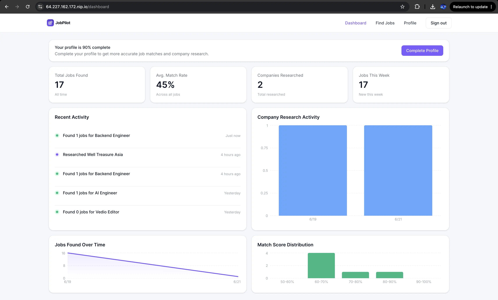
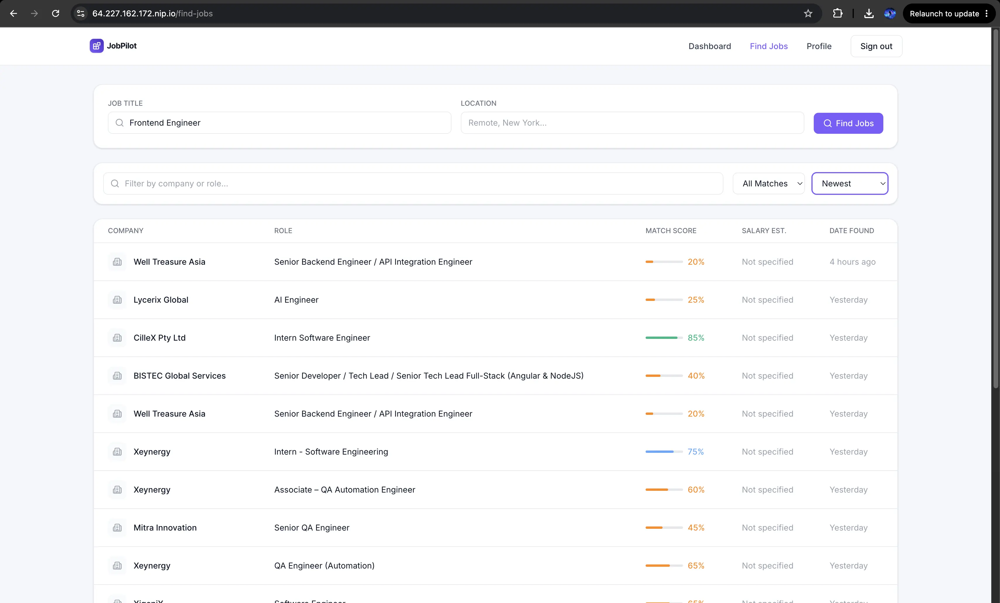
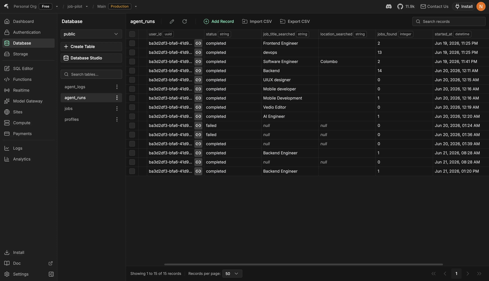
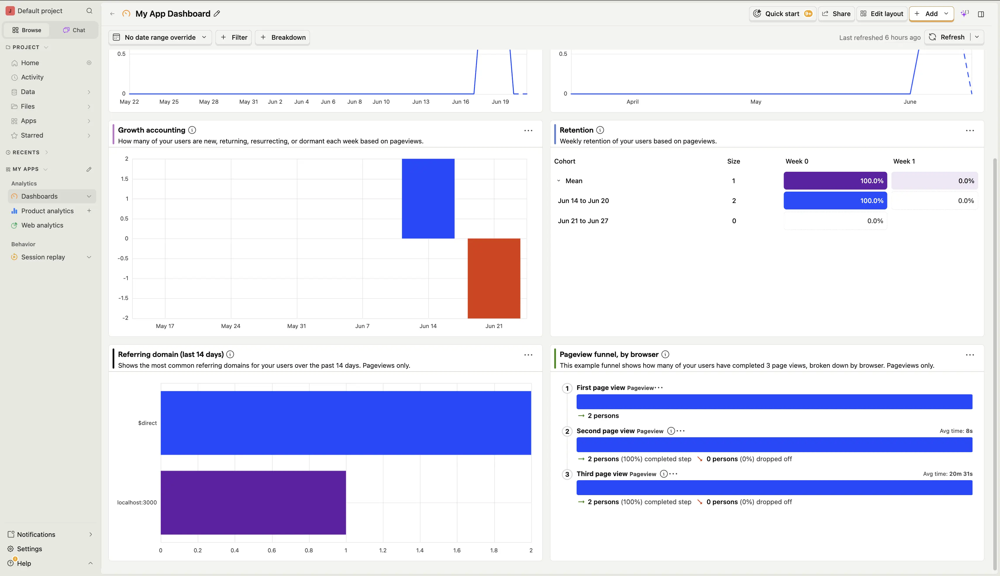
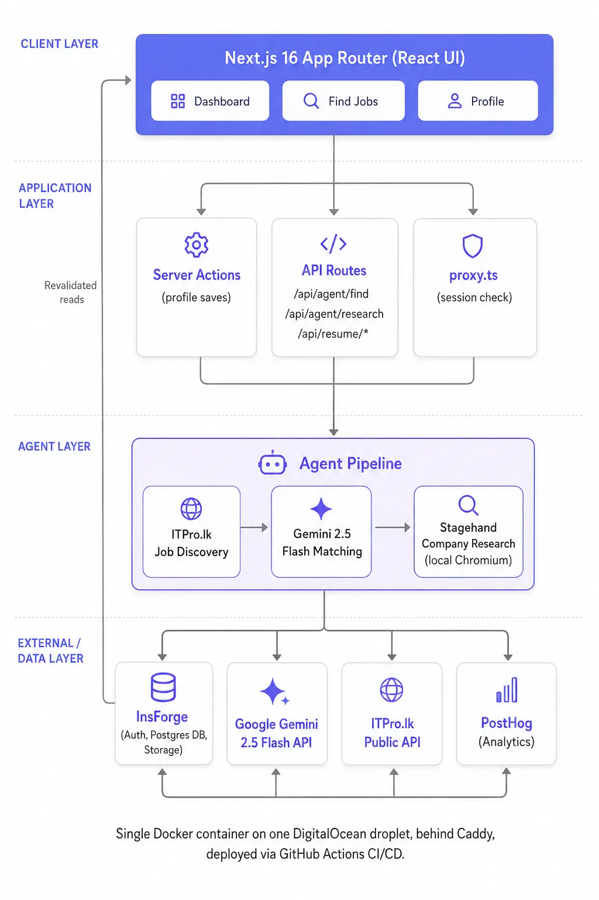

<div align="center">


### AI-powered job hunting, on autopilot.

JobPilot discovers jobs, scores them against your real skills, researches the companies, and hands you a ready-to-apply shortlist — so you spend your time applying, not searching.

[Live Demo](https://64.227.162.172.nip.io) · [Report a Bug](https://github.com/Nivin-Sithija/job-pilot/issues)

</div>

---

## About

Job hunting is repetitive: reading dozens of listings, guessing if you're even a fit, then researching each company from scratch before you can write a confident application.

JobPilot removes that grind. Set up your profile once, and an agent pipeline takes over — it pulls fresh listings, scores every job against your actual skills with Gemini 2.5 Flash, and builds a researched dossier on any company you're interested in by browsing their site for you. You stay in control of every decision; the agent just does the legwork.

<div align="center">
  
</div>

## Features

- **One-click job discovery** — search by title and location, and the agent pulls a fresh batch of listings and filters them for you.
- **AI match scoring** — every job is scored 0–100 against your profile by Gemini 2.5 Flash, with matched skills, missing skills, and a written explanation for the score.
- **AI company research agent** — a real (local, headless) browser visits a company's homepage, About, Blog, and Engineering pages and builds a structured dossier: overview, tech stack, culture, why the role likely exists, and interview talking points. Falls back to an AI-synthesized or deterministic dossier if the site can't be reached — never comes back empty.
- **Resume intelligence** — upload an existing resume PDF and auto-fill your entire profile from it, or generate a clean new resume PDF straight from your profile data, both via Gemini 2.5 Flash.
- **Full profile-based matching** — skills, experience level, industries, remote preference, and more all feed into how jobs are scored, not just keyword matching.
- **Analytics dashboard** — stats bar, recent activity feed, and PostHog-powered charts (jobs found over time, match score distribution, company research activity).
- **Google & GitHub OAuth** — sign in with either provider, no separate password to manage.
- **Sortable, filterable job list** — filter by match strength, sort by score or date, paginated for large result sets.

## How It Works

1. **Sign up** with Google or GitHub.
2. **Build your profile** — fill it manually or upload a resume and let AI extract it for you.
3. **Search for jobs** by title and location — the agent fetches and filters listings, then scores each one against your profile.
4. **Review your matches** — high-scoring jobs are visually highlighted, but every result stays visible so you decide what's worth pursuing.
5. **Research a company** with one click — the agent browses their public pages and returns a structured dossier before you apply.
6. **Apply** — JobPilot takes you straight to the real application page when you're ready.

<div align="center">
  
</div>

## Tech Stack

| Layer | Technology |
| --- | --- |
| Framework | [Next.js 16](https://nextjs.org) (App Router) |
| Language | TypeScript (strict) |
| Styling | Tailwind CSS + shadcn/ui |
| Backend (auth, DB, storage, realtime) | [InsForge](https://insforge.dev) |
| AI model | Google Gemini 2.5 Flash |
| Browser automation | [Stagehand](https://stagehand.dev) + Playwright (local Chromium) |
| Job discovery | [ITPro.lk](https://itpro.lk) public API |
| Analytics | [PostHog](https://posthog.com) |
| Charts | Recharts |
| PDF generation | @react-pdf/renderer |
| Hosting | Docker + Caddy on a single DigitalOcean droplet, shipped via GitHub Actions CI/CD |

JobPilot runs as one persistent Node process rather than split serverless functions, because the company research agent needs a real Chromium binary on disk at request time — something standard serverless platforms don't give you.

<div align="center">
  
  
</div>

## Architecture

<div align="center">
  
</div>

The UI talks to Server Actions for simple writes and to API routes for anything agent-driven. Every agent operation (job discovery, matching, company research) is rate-limited per user and always writes its result back to InsForge, which the UI then re-reads — there's no client-side polling or direct calls from components into agent code.

### Key Decisions

- **ITPro.lk over LinkedIn** — LinkedIn has no public job-search API, and scraping it violates its Terms of Service (and risks legal/account action). ITPro.lk is a legitimate, public, no-auth API, so all discovery runs through it instead.
- **Stagehand LOCAL over Browserbase cloud** — runs on the droplet's own Playwright Chromium, no per-session cloud browser cost or extra account.
- **Single droplet, not split Vercel + microservice** — the research agent needs a persistent Chromium binary on disk at request time, which serverless functions can't guarantee.
- **Caddy over Nginx + certbot** — automatic HTTPS with zero manual certificate renewal.
- **In-memory rate limiting** — fine only because the app runs as one Node process; would need Redis if ever scaled to multiple instances.

## Getting Started

### Prerequisites

- Node.js 20+
- An [InsForge](https://insforge.dev) project (auth, database, storage)
- A [Google Gemini](https://ai.google.dev) API key
- A [PostHog](https://posthog.com) project (optional, for analytics)

### Installation

```bash
git clone https://github.com/Nivin-Sithija/job-pilot.git
cd job-pilot
npm install
```

Copy the environment template and fill in your own values:

```bash
cp .env.example .env.local
```

```bash
NEXT_PUBLIC_INSFORGE_URL=
NEXT_PUBLIC_INSFORGE_ANON_KEY=
NEXT_PUBLIC_APP_URL=

NEXT_PUBLIC_POSTHOG_PROJECT_TOKEN=
NEXT_PUBLIC_POSTHOG_HOST=

GEMINI_API_KEY=

POSTHOG_API_HOST=
POSTHOG_PERSONAL_API_KEY=
POSTHOG_PROJECT_ID=
```

Run the dev server:

```bash
npm run dev
```

Open [http://localhost:3000](http://localhost:3000).

## Deployment

JobPilot ships as a single multi-stage Docker image (built on Playwright's official base image so Chromium's system dependencies are already in place) behind Caddy for automatic HTTPS. Pushing to `main` triggers a GitHub Actions pipeline that type-checks, lints, builds, pushes to GHCR, and deploys to the droplet over SSH — no manual steps.

## Credits

Built as a guided build-along of [How Senior Engineers Actually Build with AI in 2026 | Build a Full Stack Job Applications Platform](https://www.youtube.com/watch?v=9dKA2hq4vf0) by [JavaScript Mastery](https://www.youtube.com/@javascriptmastery).

## License

This project currently has no license file — all rights reserved by the author.
